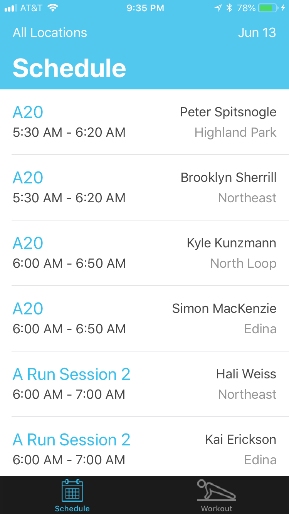
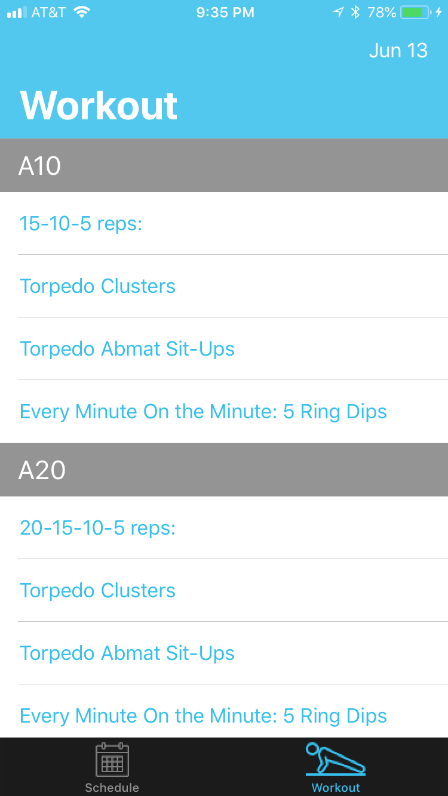
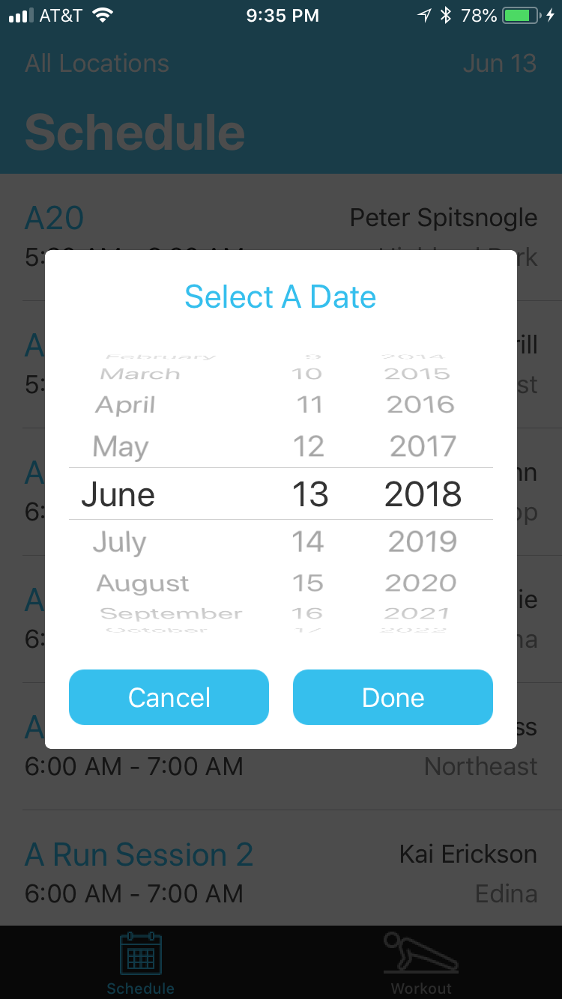
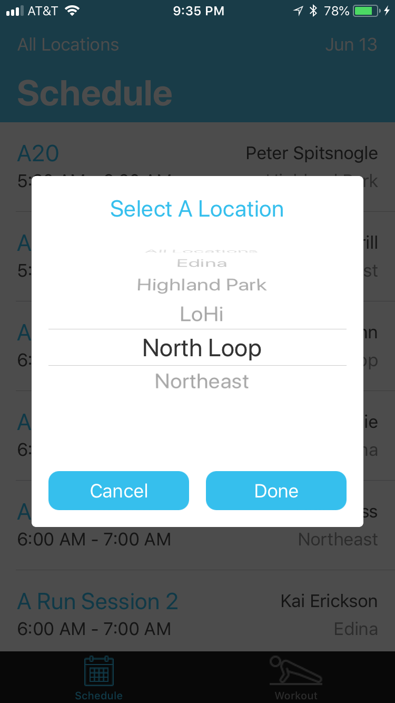

# Alchemy

This is an iOS app for displaying the daily schedule and workouts at [Alchemy](https://alchemy365.com/)

## Screenshots

|      |                |
| :---------------------------------------: | :-----------------------------------------------: |
|  |  |

## Recording


## Purpose

Alchemy is a gym that combines yoga, strength, and conditioning training in a variety of class formats. Their website displays the daily schedule and workouts, but it's slow and cumbersome. I decided to make an app to quickly get the information I want daily.

## UX
When the user opens the app, the schedule for the current day will load and display. The user can then use the modals that appear by pressing buttons in the navigation bar to change date or to filter the displayed events by location.

The user can tab over to the workout page to view the workouts of the current day. As with the schedule page, the user can press a button in the navigation bar to select a different date. 

## Challenges

Alchemy does not have a public API. Therefore, I used browser dev tools to inspect the network requests that were being made on the relevant pages, and then I mimicked those requests. 

The schedule network request goes to an internal API that returns data in a standard JSON format. Locations come back as IDs without any name associated with them, and I'm not aware of an API endpoint that I can use to retrieve that information, so I hardcoded a mapping between the IDs and  location names. There are only a few locations, so this shouldn't cause too large of scalability issues.

Retrieving workout infromation was more difficult. The main web content is served statically, so I had to scrape HTML. The HTML documents aren't cleanly organized; I'm guessing they were created in a visual editor of some kind. Below is an example of a subsection of HTML that the app would need to parse:

```html
<div class="mk-single-content clearfix" itemprop="mainEntityOfPage">
	<p><strong>A10</strong><br>
<span data-sheets-value="{&quot;1&quot;:2,&quot;2&quot;:&quot;15-10-5: Torpedo Clusters, Torpedo Abmat Sit-Ups *EMOM: 5 Ring Dips&quot;}" data-sheets-userformat="{&quot;2&quot;:4483,&quot;3&quot;:[null,0],&quot;4&quot;:[null,2,16711680],&quot;10&quot;:2,&quot;11&quot;:4,&quot;15&quot;:&quot;arial,sans,sans-serif&quot;}">15-10-5 reps:<br>
Torpedo Clusters<br>
Torpedo Abmat Sit-Ups</span></p>
<p>Every Minute On the Minute: 5 Ring Dips</p>
<p>&nbsp;</p>
<hr>
<p>&nbsp;</p>
<p><strong>A20<br>
</strong><span data-sheets-value="{&quot;1&quot;:2,&quot;2&quot;:&quot;15-10-5: Torpedo Clusters, Torpedo Abmat Sit-Ups *EMOM: 5 Ring Dips&quot;}" data-sheets-userformat="{&quot;2&quot;:4483,&quot;3&quot;:[null,0],&quot;4&quot;:[null,2,16711680],&quot;10&quot;:2,&quot;11&quot;:4,&quot;15&quot;:&quot;arial,sans,sans-serif&quot;}">20-15-10-5 reps:<br>
Torpedo Clusters<br>
Torpedo Abmat Sit-Ups</span></p>
<p>Every Minute On the Minute: 5 Ring Dips</p>
<p>&nbsp;</p>
<hr>
<p>&nbsp;</p>
<p><strong>AStrong</strong><br>
<span data-sheets-value="{&quot;1&quot;:2,&quot;2&quot;:&quot;Primary Pull - Sumo Deadlift 3-3-3-3-3 -- Superset: Turbo Burpees 5x8&quot;}" data-sheets-userformat="{&quot;2&quot;:4483,&quot;3&quot;:[null,0],&quot;4&quot;:[null,2,16776960],&quot;10&quot;:2,&quot;11&quot;:4,&quot;15&quot;:&quot;arial,sans,sans-serif&quot;}">Sumo Deadlift 3-3-3-3-3<br>
Turbo Burpees 5×8</span></p>
<p><span data-sheets-value="{&quot;1&quot;:2,&quot;2&quot;:&quot;10-8-7 ... 3-2-1 Reps: \&quot;Leave it there\&quot; sit-ups, Torpedo seated floor press, strict pull-ups&quot;}" data-sheets-userformat="{&quot;2&quot;:4995,&quot;3&quot;:[null,0],&quot;4&quot;:[null,2,16711680],&quot;10&quot;:2,&quot;11&quot;:4,&quot;12&quot;:0,&quot;15&quot;:&quot;arial,sans,sans-serif&quot;}">&nbsp;</span></p>
<hr>
<p>&nbsp;</p>
<p><strong>APulse<br>
</strong><span data-sheets-value="{&quot;1&quot;:2,&quot;2&quot;:&quot;Clusters&quot;}" data-sheets-userformat="{&quot;2&quot;:4483,&quot;3&quot;:[null,0],&quot;4&quot;:[null,2,16711935],&quot;10&quot;:2,&quot;11&quot;:4,&quot;15&quot;:&quot;arial,sans,sans-serif&quot;}">Clusters</span></p>
</div>
```

My strategy for parsing workout information was to search the above outer div by class name, recursively pull out all text from the children elements, trim the text, filter out empty strings, and then add the rest to an array. Then, once I had an array of the all of the strings, I would check for the predesignated workout class names (A10, A20, AStrong, APulse). Once I found one of these, I would know that every upcoming string that wasn't one of the class names would belong to the most recently viewed class. With this information, I could construct native objects to represent the workouts.

## Code Design

This project uses a MVVM-C (Model-ViewModel-Model-Coordinator) pattern for architecting scenes. [This talk](https://www.youtube.com/watch?v=KDl7Czw63mM) on Protocol Oriented Coordinators was an inspiration for how I set up my coordinators. I often use the [Clean Swift](https://clean-swift.com/) architecture when writing iOS apps, but I decided that so much division of responsibility wasn't necessary in a small-scale app.

I made heavy use of [RxSwift](https://github.com/ReactiveX/RxSwift) to help make the code functional and reactive. Since data displayed on the screen depended on multiple variables (events, workouts, date, location) that could change in any order, it made a lot of sense to rely on declaratively establishing observables and reacting to those changes in a unified way.

Other than the launch screen, this app doesn't contain any Storyboard or XIB files. I decided to use [SnapKit](https://github.com/SnapKit/SnapKit), an AutoLayout DSL for Swift, to declare my views instead. This was my first time taking this approach, and I ended up really liking how readable the view declarations are and how I didn't have to deal with the slowness of an interface builder. If I were working with any team members, writing view layouts in code would also help make merge conflicts more maneagable. 

## What's Next

Unit tests are the big thing missing from this app. It feels wrong not having them yet, but I've needed to prioritize speed of development up to this point, and the app isn't published yet. I'll use [Quick](https://github.com/Quick/Quick) and [Nimble](https://github.com/Quick/Nimble) for behavior-driven unit tests. 

There are a few UI enhancements I'd like to make. The first is adding a loading view other than the ActivityIndicator. I'll either overlay a loading view over the scene or use this [SkeletonView](https://github.com/Juanpe/SkeletonView) to show loading progress directly where the content will appear in each UITableViewCell. I'd also like to add a view that appears if data fails to load. Right now, just a blank screen appears.

I'd like to add functionality for adding events to the user's calendar when clicking on them.